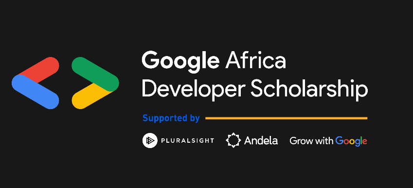
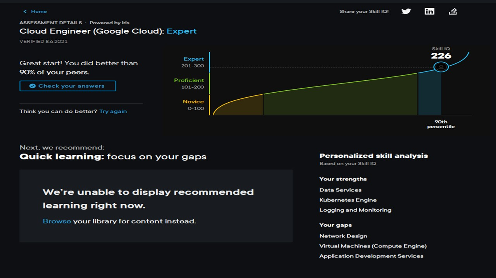

# GADS 2021

## A walk through the Google Africa Developer Scholarship 2021

## Day 1: Started phase1 with a study plan and a breaking down of the courses.

## Day 2: Cloud Computing
**Covered :** Aspects of Cloud Computing
 * Cloud Applications.
 * Cloud Platforms.
 * Private Cloud.

## Day 3: Preparing for the Associate Cloud Engineer/ACE Exam
**Covered :**
 * Resources and strategies to be more than proficient + key courses + activities.
 * Links [Pratice exam](https://cloud.google.com.certification/practice-exam/cloud-engineer) & [Exam Guide](https://cloud.google.com.certification/guides/cloud-engineer/)
 * **Key Courses :**
    * Google Cloud Fundamentals-foundation,Core services,Infrastructure, scaling and automation.
    * Architecting with Compute Engine.
    * Architecting with Kubernetes Engine
 * Looked at essential foundations.
 * Started with setting up a cloud environment.

## Day 4: Preparing for the ACE Exam
**Covered :**
 * Planning and configuring a cloud solution.
 * Lab: Tour Qwiklabs and the Google Cloud Platform.

## Day 5: Preparing for the ACE Exam
**Managed to do a review of deploying and implementing a cloud solution :**

## Day 6: Preparing for the ACE Exam
**Covered :**
 * **Deploying and implementing a cloud solution the tasks that are required :**
    * Deploying and implementing compute engine resources.
    * Deploying and implementing kubernetes engine resources.
    * Deploying and implementing App Engine and Cloud functions resources.
    * Deploying and implementing Data solutions.
    * Deploying and implementing Networking resources.
    * Using the cloud marketplace and deployment manager.
 * Lab: Setting Up Network and HTTP Load Balancers.

## Day 7: Preparing for the ACE Exam
**Covered :**
 * **Ensuring the successful operation of a cloud solution :**
    * Managing compute engine resources
    * Managing GKE resources
    * Managing App Engine resources
    * Managing Data solutions
    * Managing Networking resources
    * Monitoring and logging using Cloud Monitoring
 * Lab: Deployment Manager Full-Production 

## Day 8: Preparing for the ACE Exam + Essential Google Cloud Infrastructure-Foundations
**Covered :**
 * Configuring cloud access and security
 * Managing Identity and Access management
 * IAM roles
 * Service Accounts and cloud monitoring viewing project audit logs
 * Introduction to google cloud infrastructure-foundations  

## Day 9: Essential Google Cloud Infrastructure-Foundations
**Covered :**
 * Using the Cloud Console
 * Using the Cloud Shell
 * Lab: Console and Cloud Shell v1.5

## Day 10: Essential Google Cloud Infrastructure-Foundations
**Covered :**
 * Lab: Infrastructure Preview
 * Virtual Machines
 * Compute Engine
 * VMs (compute, storage, networking)
 * Lifecyle of VMs

## Day 11: Essential Google Cloud Infrastructure-Foundations
**Covered :**
 * VMs Pricing (Sustained Discount, preembtible VMs)
 * In depth look into images (puplic and custom)
 * Disks (boot disks and persistent disks(HDD, SSD) )
 * Configuration (Sole tenancy and shielded VMs)
 * Compute options (vCPUs, GPUs)
 * MetaData scripts and moving instances 
 * Creating snapshots and a snapshot service

 ## Day 12: Rest day 😪

 ## Day 13: Rest day 😪

 ## Day 14: Essential Google Cloud Infrastructure-Core Services
 **Covered : After some much needed rest** 😃
  * Cloud IAM
  * Resource Hierarchy
  * Roles (basic,predefines, custom)
  * Service Accounts
  * Members
  * Cloud Identity Aware Proxy
  * Cloud IAM best practices

## Day 15: Essential Google Cloud Infrastructure-Core Services 
**Covered :**
 * Cloud Storage (Storage classes, Services, File Store)
 * Choosing a storage service
 * Resource Management (Quotas, Labels, Billing )

## Day 16: Essential Google Cloud Infrastructure-Core Services
**Covered :**
 * Resources Monitoring
 * StackDriver workspaces
 * Logging
 * Tracing
 * Error Reporting
 * Debugging

## Day 17: Elastic Google Cloud Infrastructure-Scaling and Automation
**Covered :**
 * Cloud VPN
 * Cloud Interconnect and Peering
 * Choosing a Connection
 * Shared VPC and VPC Peering

## Day 18: Getting lazy now 😫

## Day 19: Elastic Google Cloud Infrastructure-Scaling and Automation
**Covered :**
 * Load Balancing
 * Global and Regional load balancers
 * Managed Instance Groups
 * HTTP load balancing + Content load balancing
 * HTTPs load balancing + target HTTPs proxy
 * SSL certificates + SSL certificate resource

## Day 20: Skill IQ Assessment

**Gaps identified :**
 * Network Design
 * Virtual Machines(Compute Engine)
 * Application Development Services
 
**Strengths identified :**
 * Data Services
 * Kubernetes Engine
 * Logging and monitoring

## Day 21: Elastic Google Cloud Infrastructure-Scaling and Automation
**Covered :**
 * Global and Regional Load Balacing
 * SSL proxy load balancing
 * TCP proxy load balancing
 * HTTPs load balancing
 * Network load balancing
 * Internal TCP//UDP load balancing
 * Internal HTTPs load balancing
 * 3 tier architecture for leveraging different load balancers 

## Day 22: Rest day 😫

## Day 23: Rest day 😫

## Day 24: Elastic Google Cloud Infrastructure-Scaling and Automation
**Covered :**
 * Infrastructure Automation
 * Using Deployment manager
 * Using Terraform
 * Using the Google Cloud MarketPlace
 * Using managed services as an alternative to infrastructure automation
 * Using data services BigQuery, DataFlow, DataProc, DataPrep
 
**This marks the end to Architecting with Compute Engine** 
 * Started with Architecting with Google Kubernetes Engine: Foundations (C1) 

## Day 25: Architecting with Google Kubernetes Engine: Foundations (C1)
**Covered :**
 * Introdution to Kubernetes and it features
 * Container layers and features
 * Docker
 * Container registry (gcr.io)
 * Cloud Build
 * kubernetes control plane (kubeApiserver,cloudmanager,etcd, scheduler,controllermanager)
 * Deployments and services
 * Migrate for Anthos

## Day 26: Architecting with Google Kubernetes Engine: Workloads (C2)
**Covered :**
 * Kubernetes Operations
 * Using the Kubectl command as a way to manage the internal state of a cluster
 
## Day 27: Rest day 😫

## Day 28: Architecting with Google Kubernetes Engine: Workloads (C2)
**Covered :**
 * Using the Kubectl command for introspection
 * Using the kubectl get command to list objects and the status of those objects
 * Using the kubectl decribe command to detailed information about services
 * Using the kubectl exec command to execute commands inside of a pod
 * Using the kubectl logs command get console output including error messages
 * Introduction to deployments,jobs and scaling

## Day 29: Rest day 😫 now I'm just lazy

## Day 30: Architecting with Google Kubernetes Engine: Workloads (C2)
**Covered :**
 * Deployments as a way of declaring the state of pods
 * Creating a deployment manifest file
 * States of a deploymnt (progressing, complete, failed)
 * Updating the deployment
 * Scaling (manually, autoscaler,horizontal-pod-autoscaler object) and handling thrashing 

## Day 31: Architecting with Google Kubernetes Engine: Workloads (C2)
**Covered :**
 * Rolling Updates
 * Blue/Green Deployment
 * Canary Deployment
 * Managing Deployments (pausing,resuming,deleting,monitoring)
 * Jobs and CronJobs

## Day 32: Architecting with Google Kubernetes Engine: Workloads (C2)
**Covered :**
 * Cluster scaling, using the autoscaler
 * Node pools,pods, autoscaling best practices,
 * Controlled placement,control scheduling using the nodeSelector+labels
 * Node affnitty and anti-affinity,taints and tolerations
 * Managing node pools
 * Getting software into clusters using helm(architecture+charts), using yaml to define images from the cloud registry and the google cloud market place

## Day 33: Architecting with Google Kubernetes Engine: Workloads (C2)
**Covered :**
 * GKE k8 networking -pod to pod communication

## Day 34: Rest day 😫 

## Day 35: Architecting with Google Kubernetes Engine: Workloads (C2)
**Covered :**
 * Services (help to give pods a stable name through the changing lifecycle of a pod+ help direct traffic to suitable pods)
 * Finding a service(Environment variables,Kuber DNS, Istio)
 * Service types(ClusterIP(internal communication), NodePort(external communication)+ default range(30000 -32767),LoadBalancer)

## Day 36: Rest day 😫 It's getting hectic.

## Day 37: Architecting with Google Kubernetes Engine: Workloads (C2)
**Covered :**
 * Ingress Resource + features (multi regional/cluster, TLS termination,location based load-balancing, multiple ssl certificates)
 * Container Native load balancing
 * Network End Group
 * Network security
 * Enabling + creating a network policy for clusters
 * Why use a network policy
 
## Day 38: Architecting with Google Kubernetes Engine: Workloads (C2)
**Covered :**
 * Persitent data and storage
 * Volumes: A way to attach storage to pods/help containers share data
 * Secrets: Store sensitive information (authentication/authorization data)
 * StatefulSets: Manage ordered deployment of pod and storage
 * ConfigMaps: Decouple artifacts from pod definition
 * Volume Types (configMaps, secrets, emptyDir,NFS, downwardAPI)
 
## Day 39: Architecting with Google Kubernetes Engine: Workloads (C2)
**Covered :**
 * Indepth view of volumes , secrets, configMaps, statefulSets
 * Using volumes, persistent volume, persistent volume claims
 * Using secrets and secret types
 * Using a configMap
 * Using statefulSets
 *Creating and updating storage abstractions

**This marks the end to Architecting with Google Kubernetes Engine: Workloads (C2)** 

## Day 40: Architecting with Google Kubernetes Engine: Production
**Covered :**
 * Authentication and Authorization for access control
 * Cloud IAM and RBAC, roles and roleBindings
 * Control plane security and Certificate Authority 
 * Protecting metadata
 * Pod Security
 * Using security context to limit privileges to containers
 * Creating reusable security contexts by using security policies that can apply to many pods
 * PodSecurityPolicy and PodSecurityPolicy controller which validates and modifies requests against one or more PodSecurityPolicies

## Day 41: Architecting with Google Kubernetes Engine: Production
**Covered :**
 * Logging and Monitoring
 * Using google clouds operations suite to monitor and manage the availability and performance.
 * Locate and inspect Kubernetes logs inside the cluster.
 * Perform forensic analysis of logs using BigQuery and use Stackdriver + Cloud storage for longer retention of logs.
 * Monitoring performance from different vantage points
 * Create probes for wellness checks on live application (readiness + liveliness)

## Day 42: Architecting with Google Kubernetes Engine: Production
**Covered :**
 * Using Google Cloud Managed Storage services with GKE.
 * Understanding the full range of google cloud managed	 storage services.
 * Understanding the pros and cons of storage managed services vs self managed containarized storage.
 * Using Cloud SQL from within a Kubernetes Application through Cloud SQL Proxy.
 
 
## Day 43: Architecting with Google Kubernetes Engine: Production 
**Covered :**
 * CI/CD background and examples.
 * Using Cloud Build to create a continuous delivery pipeline.
 * CI/CD architecture.
 * Google cloud markteplace CI/CD tools (Jenkins,Spinnaker,CircleCI,Drone,Cloud Build,GitLab CI).

** This marks the end of Architecting with Google Kubernetes Engine: Production**
 
## Day 44: Rest day 😫

## Day 45: Google Cloud Platform Fundamentals
**Covered :**
 * GCP fundamentals (themes, philosophies and priciples)
 * How GCP is different from other cloud provider (networking,pricing,technology)
 * Service Background/timeline
 * Getting Started (using the pricing calculator)

## Day 46: Google Cloud Platform Fundamentals
**Covered :**
 * Google Cloud Platform building blocks
 * Common Infrastructure across google
 * Layering of services
 * Compute, storage, network
 * Enabling cloud 3.0
 * **Security and Tools :**
    * Complexity leads to risk
	* Googles security capabilties and its approach to security
	* Insfrastructure Security (data center, hardware, software, employees,storage)
	* Service to service security model (explicit identity, policy enforcement, secure communication(RPC), user data protection)
	* Security services -Internet traffic(TLS termination,Network Segmentation,DoS protection,public ip and DNS hosting)
	* Security Configuration -Service Accounts and IAM
	* Management and Billing
	* Developer tooling

## Day 47: Google Cloud Platform Fundamentals
**Covered :**
 * Cloud 2.0
 * Transitioning from Cloud 2.0 to Cloud 3.0
 * Moving from VMs to application and functions
 * Using policies
 * SLA'scaling
 * Task automation
 * Container Orchestration
 * Intelligence over data processing
 * Single state machine mode (model the states and state transitions)
 * Analytics and integrating ML to other services

**This marks the end of Google Cloud Platform Fundamentals** 
 
## Day 48: Rest day 😫

## Day 49: Rest day 😫

## Day 50: Developing a Google SRE Culture 
**Covered :**
 * What is Site Realibility Engineering vs DevOps.
 * Why Site Realibility Engineering.
 * The value of SRE to IT operations and ones organization.
 * Using SLOs to guide business decisions.
 * looking at the pillars of SRE -> reducing silos, accepting failures and blameless postmortems.
 
## Day 51: Rest day 😫
 
## Day 52: Developing a Google SRE Culture 
**Covered :**
 * Site Realibility Objectives
 * Realibility
 * SLIs Site Realibility Indicators
 * Breaking down or reducing organizational silos
 * Pyschological safety
 * Error budgeting
 
## Day 53: Developing a Google SRE Culture
**Covered :**
 * Making tomorrow better through gradual change.
 * What CI/CD are, its components and benefts.
 * What Canary Deployment is and its requirements.
 * What Design Thinking is and its priciples.
 * What Toil is and the impact of it once it is excessive.
 * The value of Automation.
 
 
 
 
 
 
 